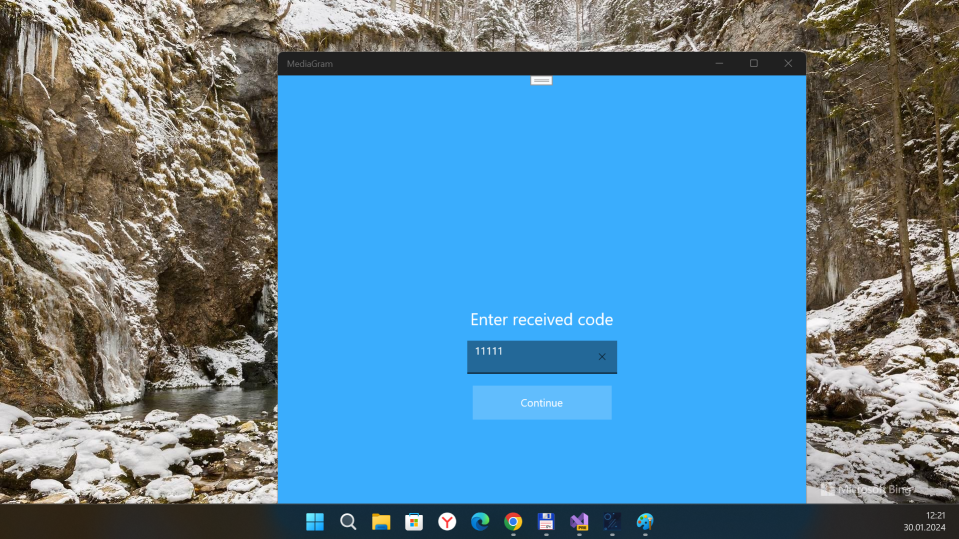
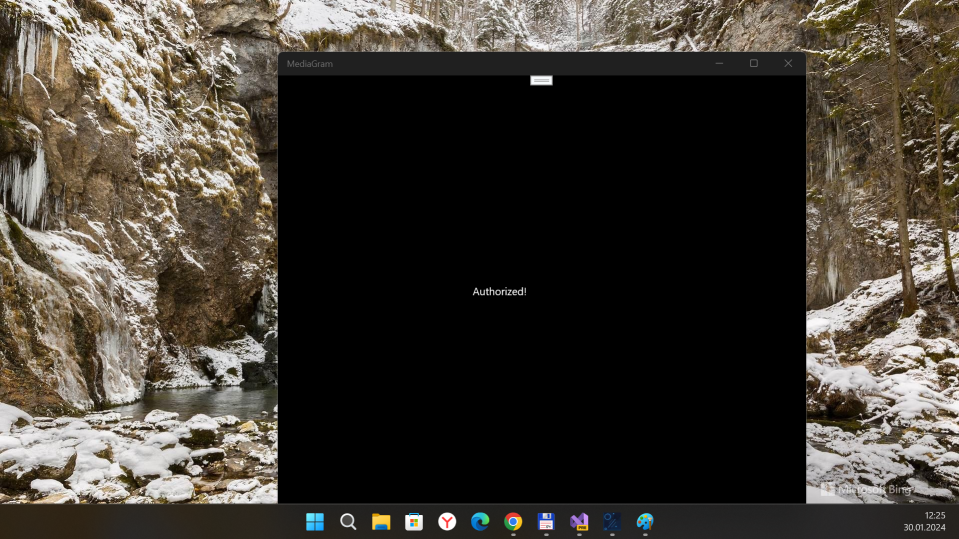

# MediaGram 

My fork of [sochix/TLSharp](https://github.com/sochix/TLSharp) project.

##  What is MediaGram?
MediaGram is my UWP app simplest demo. It uses fully-asynchronous TLSharp library's that implements the MTProto protocol and the Telegram API.\
This means you can interact with the Telegram API (**as a regular user** as well) **without having any knowledge of the encryption and communication protocol**. 
It also implements many aspects of the API so **you won't have to take care of any database implementation or updates handling.**

## Screenshot(s)

## Status of my fork (RnD progress)
- For more UWP compatibility, .NET standard 2.0 used, not .NET 6, 7 or 8...
- No C++, only C#, only hardcore! :))))
- Login ok! Desktop (min. os build = 19041) sample micro-app ready! ;)

## References
- https://github.com/sochix/TLSharp Telegram client library implemented in C#

## ..
As is. No support. RnD only. DIY.

## .
[m][e] 2024

